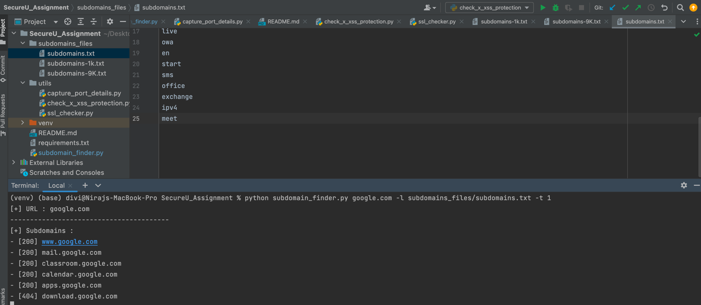
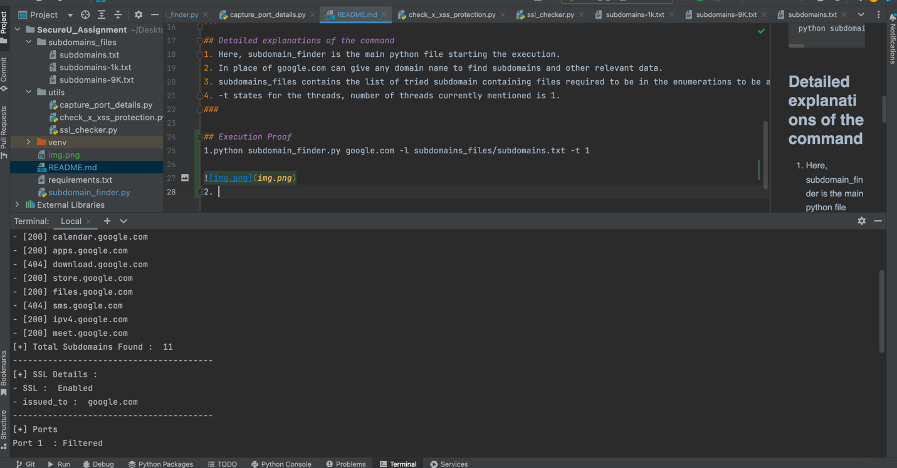

# SecureU_Assignment

## Installation
After cloning the repository and navigating to the created folder, simply run:
```bash
pip install -r requirements.txt
```

## Steps to Run

1. Import in the PyCharm, any IDE & Open Terminal

## Command
```bash
python subdomain_finder.py google.com -l subdomains_files/subdomains.txt -t 1
```
## Detailed explanations of the command
1. Here, subdomain_finder is the main python file starting the execution. 
2. In place of google.com can give any domain name to find subdomains and other relevant data. 
3. subdomains_files contains the list of tried subdomain containing files required to be in the enumerations to be added as prefix. 
4. -t states for the threads, number of threads currently mentioned is 1.
###

## Execution Proof
1.python subdomain_finder.py google.com -l subdomains_files/subdomains.txt -t 1




2. 

3. Detailed Console Logs are attached as :
```bash
console_log.txt

https://github.com/githubbydivya/SecureU_Assignment/blob/master/console_log.txt
```

###
